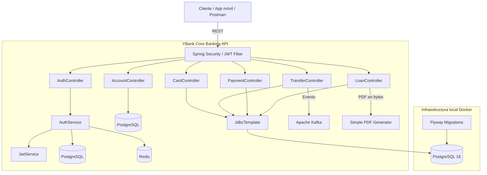

# YBank Core Banking API

[](https://openjdk.org/)
[](https://spring.io/projects/spring-boot)
[](#cicd-github-actions)
[](https://www.postgresql.org/)
[](https://redis.io/)
[](https://kafka.apache.org/)

Backend de core bancario moderno para portafolios profesionales, inspirado en flujos reales de banca móvil. Expone una API REST con autenticación JWT, cuentas, tarjetas, transferencias internas e interbancarias, pagos, recargas, préstamos digitales y generación de cronogramas PDF.

El proyecto combina Spring Boot, PostgreSQL, Redis, Kafka, Flyway y Docker para ofrecer una base local reproducible y cercana a un entorno bancario transaccional.

---

## Arquitectura del Sistema

El backend sigue una arquitectura por dominios dentro del paquete `com.ybank.core`. Usa Spring Data JPA para entidades base y `JdbcTemplate` para flujos financieros donde se requiere control explícito sobre SQL, bloqueos y transacciones.



---

## Stack Tecnológico

- **Java 21**: versión base del proyecto.
- **Spring Boot 3.3.5**: framework principal para la API REST.
- **Spring Security + JWT**: autenticación stateless y protección de endpoints.
- **Spring Data JPA / Hibernate**: persistencia de entidades base.
- **JdbcTemplate**: SQL directo para operaciones financieras críticas.
- **PostgreSQL 16**: base de datos transaccional.
- **Flyway**: migraciones versionadas en `src/main/resources/db/migration`.
- **Redis**: soporte de cache y OTP demo.
- **Apache Kafka**: publicación de eventos de transferencias.
- **OpenAPI / Swagger UI**: documentación interactiva de la API.
- **Docker / Docker Compose**: infraestructura local reproducible.
- **GitHub Actions**: pipeline de build y verificación.

---

## Estructura del Código

```text
src/main/java/com/ybank/core
├── account      # Cuentas, saldos y movimientos
├── auth         # Registro, login, OTP y JWT
├── card         # Tarjetas del cliente
├── common       # ApiResponse, excepciones y manejo global de errores
├── config       # Seguridad y OpenAPI
├── loan         # Simulación, desembolso y PDF de préstamos
├── payment      # Servicios, recargas y pagos tipo Yape
└── transfer     # Transferencias internas, externas y eventos Kafka
```

Archivos relevantes:

- [`pom.xml`](pom.xml): dependencias Maven y configuración del build.
- [`docker-compose.yml`](docker-compose.yml): API, PostgreSQL, Redis, Zookeeper y Kafka.
- [`src/main/resources/application.yml`](src/main/resources/application.yml): configuración de Spring Boot.
- [`src/main/resources/db/migration`](src/main/resources/db/migration): migraciones Flyway.
- [`.github/workflows/ci.yml`](.github/workflows/ci.yml): pipeline CI/CD.

---

## Base de Datos

El esquema se crea mediante Flyway al iniciar la aplicación. Las migraciones actuales incluyen:

| Migración | Contenido principal |
| --- | --- |
| `V1__init.sql` | Usuarios, cuentas y transferencias base. |
| `V2__seed_victor_login.sql` | Usuario demo, cuenta y tarjeta. |
| `V3__mobile_banking_demo_data.sql` | Perfil de cliente, movimientos, beneficiarios, notificaciones, servicios y productos de préstamo. |
| `V4__transactional_banking_flows.sql` | Bancos externos, contactos Yape, pagos Yape, operadores móviles y recargas. |
| `V5__real_loan_applications.sql` | Solicitudes de préstamo y cuotas del cronograma. |

Tablas principales:

| Tabla | Propósito |
| --- | --- |
| `users` | Credenciales, datos de acceso y roles. |
| `customer_profiles` | Información de contacto y segmento del cliente. |
| `accounts` | Cuentas bancarias y saldos. |
| `account_movements` | Historial de movimientos. |
| `user_cards` | Tarjetas asociadas al cliente. |
| `transfers` | Transferencias internas y externas. |
| `external_banks` | Catálogo de bancos externos y comisiones. |
| `beneficiaries` | Contactos bancarios frecuentes. |
| `yape_contacts` | Contactos para pagos inmediatos. |
| `yape_payments` | Pagos tipo Yape. |
| `mobile_operators` | Operadores móviles. |
| `mobile_recharges` | Recargas móviles. |
| `service_bills` | Servicios afiliados. |
| `bill_payments` | Pagos de servicios. |
| `loan_products` | Productos de préstamo. |
| `loan_applications` | Solicitudes y desembolsos. |
| `loan_installments` | Cuotas de préstamo. |
| `notifications` | Notificaciones del cliente. |

---

## Ejecución Local

### Prerrequisitos

- JDK 21.
- Maven 3.9 o superior.
- Docker Desktop con Docker Compose.

### Opción 1: ejecutar todo con Docker Compose

```bash
docker compose up --build
```

Con esta opción la API queda expuesta en:

- Swagger UI: [http://localhost:8081/swagger-ui.html](http://localhost:8081/swagger-ui.html)
- Healthcheck: [http://localhost:8081/actuator/health](http://localhost:8081/actuator/health)

### Opción 2: ejecutar infraestructura en Docker y API con Maven

Levanta PostgreSQL, Redis y Kafka:

```bash
docker compose up -d postgres redis kafka
```

Configura las variables para usar el PostgreSQL publicado por Docker en el puerto `5433`:

```powershell
$env:DB_URL="jdbc:postgresql://localhost:5433/ybank"
$env:DB_USER="ybank"
$env:DB_PASSWORD="ybank123"
$env:REDIS_HOST="localhost"
$env:REDIS_PORT="6379"
$env:KAFKA_BOOTSTRAP_SERVERS="localhost:9092"
```

Compila y ejecuta:

```bash
mvn clean verify
mvn spring-boot:run
```

Con esta opción la API queda expuesta en:

- Swagger UI: [http://localhost:8080/swagger-ui.html](http://localhost:8080/swagger-ui.html)
- Healthcheck: [http://localhost:8080/actuator/health](http://localhost:8080/actuator/health)

### Usuario demo

Las migraciones crean un usuario demo para pruebas locales:

| Campo | Valor |
| --- | --- |
| Documento | `77777777` |
| Email | `victor@ybank.pe` |
| Password | `123456` |
| 2FA | Desactivado |

---

## Variables de Entorno

| Variable | Valor por defecto |
| --- | --- |
| `DB_URL` | `jdbc:postgresql://localhost:5432/ybank` |
| `DB_USER` | `ybank` |
| `DB_PASSWORD` | `ybank123` |
| `REDIS_HOST` | `localhost` |
| `REDIS_PORT` | `6379` |
| `KAFKA_BOOTSTRAP_SERVERS` | `localhost:9092` |
| `SERVER_PORT` | `8080` |
| `JWT_SECRET` | Llave demo configurada en `application.yml` |

Puedes usar [`.env.example`](.env.example) como referencia para entornos locales o Docker.

---

## Endpoints Principales

Salvo los endpoints públicos de autenticación, las rutas requieren:

```http
Authorization: Bearer <JWT_TOKEN>
```

### Autenticación (`/api/v1/auth`)

| Método | Ruta | Descripción |
| --- | --- | --- |
| `POST` | `/register` | Registra un cliente. |
| `POST` | `/login/prepare` | Valida credenciales y prepara el flujo OTP. |
| `POST` | `/login` | Login directo para desarrollo. |
| `POST` | `/otp/verify` | Verifica OTP y devuelve JWT. |
| `GET` | `/me` | Devuelve el cliente autenticado. |

### Cuentas (`/api/v1/accounts`)

| Método | Ruta | Descripción |
| --- | --- | --- |
| `GET` | `/` | Lista las cuentas del cliente. |
| `GET` | `/home-summary` | Resumen para pantalla principal. |
| `GET` | `/movements` | Últimos movimientos. |
| `GET` | `/{accountNumber}` | Detalle de una cuenta. |

### Tarjetas (`/api/v1/cards`)

| Método | Ruta | Descripción |
| --- | --- | --- |
| `GET` | `/` | Lista tarjetas del cliente. |
| `PATCH` | `/{id}/status` | Activa o bloquea una tarjeta. |

### Transferencias (`/api/v1/transfers`)

| Método | Ruta | Descripción |
| --- | --- | --- |
| `GET` | `/banks` | Lista bancos externos y comisiones. |
| `POST` | `/` | Procesa una transferencia. |
| `GET` | `/` | Lista historial de transferencias. |

### Pagos (`/api/v1/payments`)

| Método | Ruta | Descripción |
| --- | --- | --- |
| `GET` | `/services` | Lista servicios disponibles. |
| `POST` | `/` | Paga un servicio. |
| `GET` | `/yape-contacts` | Lista contactos Yape. |
| `POST` | `/yape` | Envía un pago inmediato. |
| `GET` | `/mobile-operators` | Lista operadores móviles. |
| `POST` | `/recharges` | Realiza una recarga móvil. |

### Préstamos (`/api/v1/loans`)

| Método | Ruta | Descripción |
| --- | --- | --- |
| `GET` | `/products` | Lista productos de préstamo. |
| `POST` | `/simulate` | Simula crédito con amortización francesa. |
| `POST` | `/applications` | Solicita y desembolsa préstamo. |
| `GET` | `/applications` | Lista préstamos del cliente. |
| `GET` | `/applications/{id}/schedule.pdf` | Descarga cronograma PDF. |

---

## CI/CD: GitHub Actions

El pipeline está definido en [`.github/workflows/ci.yml`](.github/workflows/ci.yml). Se ejecuta en cada `push` a `main` o `develop`, y en cada `pull_request` hacia `main`.

Pasos principales:

1. Descarga el código fuente.
2. Configura Java 21 con Temurin.
3. Habilita cache de Maven.
4. Imprime versiones de Java y Maven.
5. Ejecuta `mvn -B clean verify`.

---

## Pruebas

Para ejecutar la suite local:

```bash
mvn test
```

Actualmente el proyecto incluye pruebas para el servicio JWT en [`src/test/java/com/ybank/core/auth/JwtServiceTest.java`](src/test/java/com/ybank/core/auth/JwtServiceTest.java).
